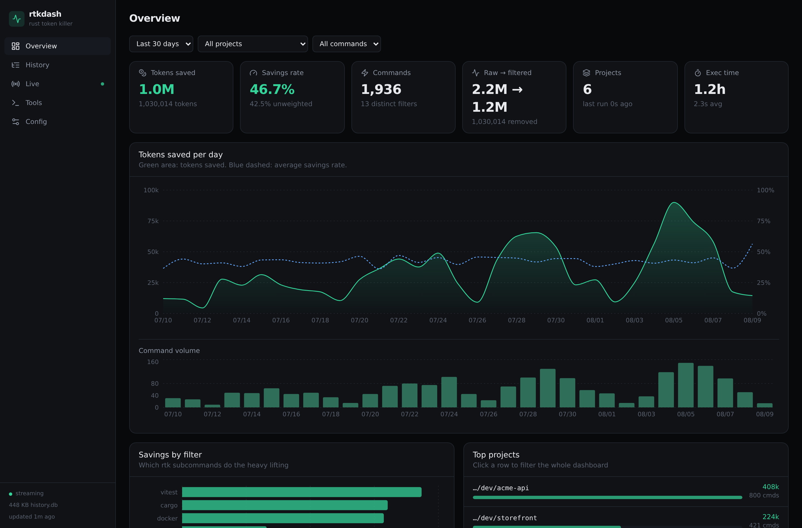
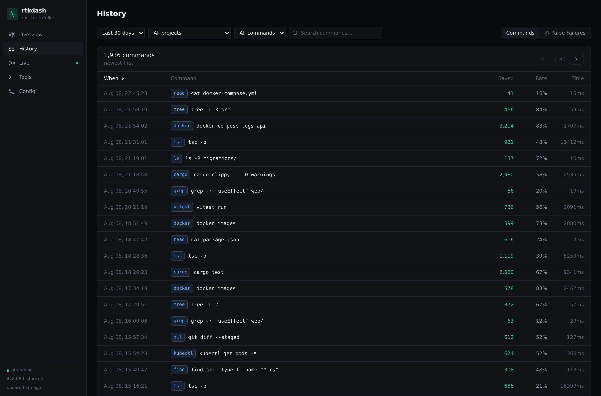
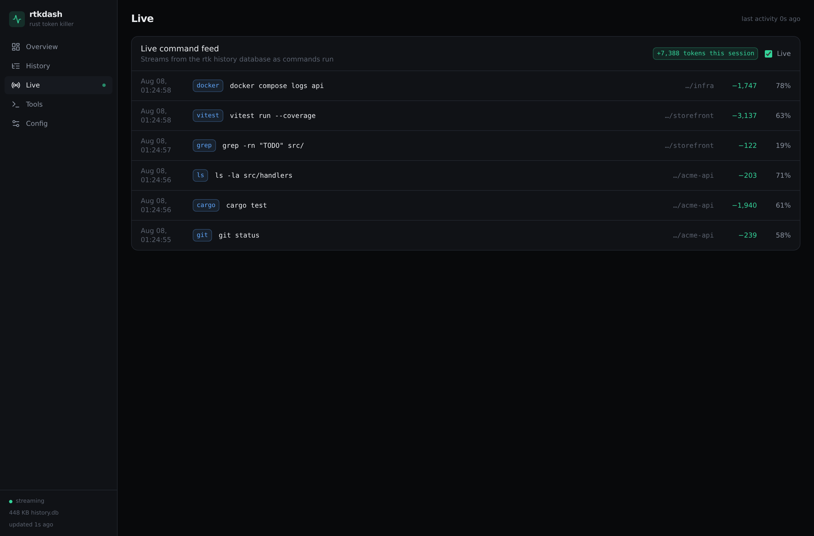
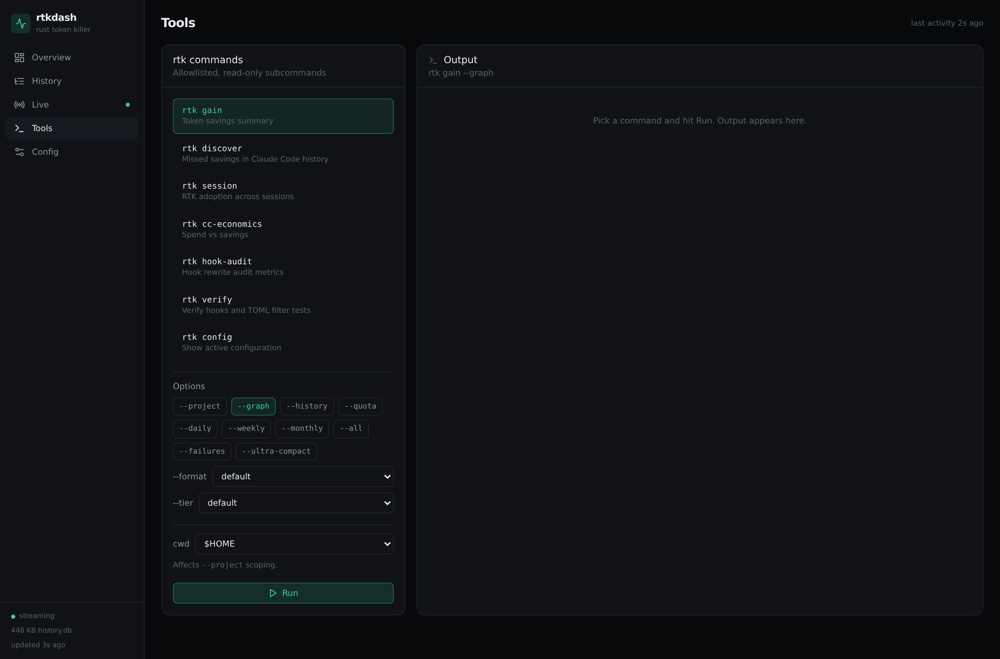
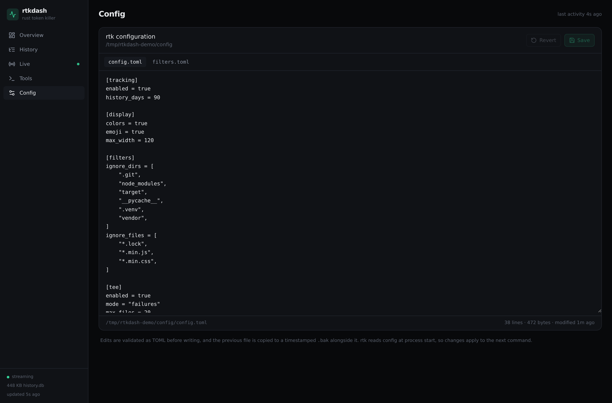

# rtkdash

[](https://github.com/mastervash/rtk-dashboard/actions/workflows/ci.yml)

A web dashboard for [rtk](https://github.com/rtk-ai/rtk) (Rust Token Killer) — token savings analytics, a live command feed, an allowlisted command runner, and a TOML config editor.

rtk already records every filtered command to a local SQLite database. rtkdash reads that database and gives you the parts `rtk gain` can't show in a terminal: savings trends over time, which subcommands actually earn their keep, per-project breakdowns, and a searchable history you can drill into.



<details>
<summary>More screenshots</summary>

**History** — searchable, sortable, expandable per-command detail


**Live** — SSE feed of commands as they run


**Tools** — allowlisted rtk subcommand runner


**Config** — TOML editor with validation and backups


</details>

> All screenshots use synthetic data generated by `scripts/seed-demo.mjs`.

> **AI disclosure:** this project was written almost entirely by Claude (Anthropic's Claude Code), from the schema exploration through the API, the UI, and this README. A human directed the scope, made the architectural calls, and reviewed and tested the result — but if you are auditing this code before running it, assume every line is machine-authored and read it accordingly. Given that it executes commands and writes files on your host, that review is worth doing.

## Requirements

- **Node.js 20+** (uses `better-sqlite3`, which needs a prebuilt binary or a working toolchain)
- **rtk** installed and tracking enabled — check with `rtk gain`
- An existing rtk history database. Fresh installs have none until you run some hooked commands.

## Install

```bash
git clone https://github.com/mastervash/rtk-dashboard.git rtkdash
cd rtkdash
npm install
```

## Run

Development — Vite dev server plus the API, with hot reload:

```bash
npm run dev
```

- UI: http://127.0.0.1:5177
- API: http://127.0.0.1:5178

Production — the API serves the built SPA, so everything is on one port:

```bash
npm run build
npm start
```

Then open http://127.0.0.1:5178.

### Without an rtk history database

If you want to look around before committing — or you're developing against the
UI — seed a synthetic database:

```bash
node scripts/seed-demo.mjs
RTKDASH_DB=demo/history.db RTKDASH_CONFIG_DIR=demo/config npm start
```

That generates ~1,900 fake commands across six fictional projects over 30 days.
It touches nothing outside the target directory, and the PRNG is seeded, so the
charts are reproducible.

## Views

| View | What it shows |
| --- | --- |
| **Overview** | KPIs (tokens saved, savings rate, raw→filtered, exec time), tokens-saved-per-day chart with an average savings-rate overlay, command volume, savings by rtk subcommand, and a top-projects list that filters the whole dashboard on click |
| **History** | Paginated, sortable, searchable command log; expand any row for the original vs. rewritten command, project, and token math. Separate tab for rtk parse failures |
| **Live** | Server-sent-events feed of commands as rtk records them, with a running total for the session |
| **Tools** | Runs allowlisted `rtk` subcommands and renders their output |
| **Config** | Edits `config.toml` / `filters.toml` with live TOML validation and automatic backups |

## Configuration

Copy `.env.example` to `.env`, or export the variables directly.

| Variable | Default | Purpose |
| --- | --- | --- |
| `RTKDASH_DB` | `~/.local/share/rtk/history.db` | History database path |
| `RTKDASH_CONFIG_DIR` | `~/.config/rtk` | Directory containing the editable TOML files |
| `RTKDASH_RTK_BIN` | `rtk` | Binary used by the Tools runner |
| `RTKDASH_HOST` | `127.0.0.1` | Bind address. Only widen this behind an authenticating proxy |
| `RTKDASH_API_PORT` | `5178` | API port (also serves the SPA in production) |
| `RTKDASH_WEB_PORT` | `5177` | Vite dev server port |
| `RTKDASH_ALLOWED_ORIGINS` | — | Comma-separated public origins allowed to call the API. Loopback is always allowed; `*` disables the check |
| `RTKDASH_TRUST_PROXY` | — | Passed to Express `trust proxy` so `X-Forwarded-*` is honored (e.g. `loopback`) |
| `RTKDASH_POLL_MS` | `1500` | Live-tail poll interval |
| `RTKDASH_READONLY` | `0` | Set to `1` to disable the command runner and config writes |

## Data sources

Everything comes from rtk's own storage — rtkdash collects nothing of its own.

- `~/.local/share/rtk/history.db` — tables `commands` and `parse_failures`
- `~/.config/rtk/config.toml` and `filters.toml`

The database is opened **read-only**. The Config editor is the only thing that writes, and only to those two files.

One note on the numbers: the headline savings rate is token-weighted (`saved / input`), which is what `rtk gain` reports. The unweighted mean of per-command percentages appears underneath it. The two can differ substantially — a handful of large `vitest` or `docker` runs dominate the weighted figure while hundreds of tiny `grep` calls dominate the unweighted one.

## Docker

```bash
docker compose up -d --build
```

Then open http://127.0.0.1:5178.

The image mounts rtk's history database read-only and defaults to
`RTKDASH_READONLY=1`. **Analytics, live tail, and the config viewer all work.
The Tools runner does not** — the `rtk` binary is not in the image, and even
with it added, the project paths recorded in the database are host paths that
do not exist in the container, so `--project` scoping would silently target the
wrong thing. Run rtkdash on the host if you want the runner.

To enable the config editor, drop `:ro` from the `/config` mount and set
`RTKDASH_READONLY=0`.

**File ownership matters.** The database belongs to whichever host user runs
rtk. The compose file passes `${UID}:${GID}`, but your shell may not export
those — either export them or hardcode the uid:

```bash
UID="$(id -u)" GID="$(id -g)" docker compose up -d
```

### With a containerized reverse proxy

This is the tidiest deployment. Uncomment the `networks` blocks in
`compose.yaml` to join the proxy's existing network:

```yaml
networks:
  proxy:
    external: true
    name: nginxproxymanager_default
```

The proxy then reaches rtkdash at `http://rtkdash:5178` by container name. No
host firewall rule, no bridge gateway address, and nothing that breaks when
Docker reassigns a subnet — all three problems the host-install path below has
to work around. Delete the `ports:` block so the port is not also published on
the host.

## Running behind a reverse proxy

rtkdash has **no authentication of its own**. If you expose it, put an authenticating proxy in front and read the security section below first.

Two things it needs from any proxy:

1. **The public origin must be allowlisted.** Browsers send `Origin` on POST/PUT, and the API rejects origins it does not know. Without this, the dashboard loads and charts render, but the Tools runner and config Save return 403.
2. **SSE must not be buffered.** `/api/stream` is a long-lived event stream. A buffering proxy leaves the Live tab connected but permanently silent.

```bash
RTKDASH_HOST=127.0.0.1 \
RTKDASH_ALLOWED_ORIGINS=https://rtk.example.com \
RTKDASH_TRUST_PROXY=loopback \
npm start
```

### nginx

```nginx
location / {
    proxy_pass http://127.0.0.1:5178;
    proxy_http_version 1.1;
    proxy_set_header Host $host;
    proxy_set_header X-Forwarded-For $proxy_add_x_forwarded_for;
    proxy_set_header X-Forwarded-Proto $scheme;
}

location /api/stream {
    proxy_pass http://127.0.0.1:5178;
    proxy_http_version 1.1;
    proxy_set_header Connection '';
    proxy_buffering off;
    proxy_cache off;
    proxy_read_timeout 24h;
}
```

### Caddy

```caddyfile
rtk.example.com {
    basic_auth {
        you $2a$14$...   # caddy hash-password
    }
    reverse_proxy 127.0.0.1:5178
}
```

Caddy handles SSE and forwarded headers correctly by default.

### Nginx Proxy Manager (in Docker)

This one has a wrinkle. NPM runs in a container, so `127.0.0.1` inside it is the *container's* loopback, not the host's — a proxy host pointing at `127.0.0.1:5178` will never connect.

**1. Find the host-side gateway of NPM's Docker network.**

```bash
docker inspect nginxproxymanager-app-1 \
  --format '{{range $k,$v := .NetworkSettings.Networks}}{{$k}} gateway={{$v.Gateway}}{{"\n"}}{{end}}'
```

Typically something like `172.23.0.1`. That address is reachable from containers on that network and from the host, but not from your LAN.

**2. Bind rtkdash to it.**

```bash
RTKDASH_HOST=172.23.0.1 \
RTKDASH_ALLOWED_ORIGINS=https://rtk.example.com \
npm start
```

**3. Open the port to that Docker subnet only.** If the host runs ufw (or any default-deny `INPUT` policy), container→host traffic is dropped and the proxy will time out:

```bash
sudo ufw allow from 172.23.0.0/16 to 172.23.0.1 port 5178 proto tcp comment 'rtkdash from NPM'
```

**4. Create the proxy host** — scheme `http`, forward hostname `172.23.0.1`, port `5178`, **Websockets Support** enabled. Then in the **Advanced** tab, add the SSE block so the Live feed works:

```nginx
location /api/stream {
    proxy_pass http://172.23.0.1:5178;
    proxy_http_version 1.1;
    proxy_set_header Connection '';
    proxy_buffering off;
    proxy_cache off;
    proxy_read_timeout 24h;
}
```

**5. Add auth** — an NPM Access List gets you basic auth in a couple of clicks. Forward-auth through Authelia, Authentik, or similar is stronger, and worth it given what the Tools runner can do.

Two caveats specific to this setup:

- **The firewall rule opens the port to every container on that Docker network**, not just NPM — those containers reach the API directly, bypassing your proxy auth entirely. If other services share the network, either set `RTKDASH_READONLY=1` or give NPM and rtkdash a dedicated bridge.
- **The subnet is not pinned.** Docker assigns `172.x.0.0/16` dynamically, and recreating NPM's compose network can move it, silently breaking both the bind address and the firewall rule. Pin it with an explicit `ipam` subnet in NPM's compose file if you want this to survive teardowns.

### systemd (user service)

`contrib/rtkdash.service` is a ready-to-edit unit. Install it as a user service so it runs as the account that owns the rtk database:

```bash
mkdir -p ~/.config/systemd/user
cp contrib/rtkdash.service ~/.config/systemd/user/
# edit WorkingDirectory and the Environment= lines
systemctl --user daemon-reload
systemctl --user enable --now rtkdash
sudo loginctl enable-linger "$USER"   # so it starts without an active login
```

## Security model

rtkdash executes commands and writes files on the host. It is built for a single local user, and the defaults reflect that.

- **Loopback by default.** The server binds `127.0.0.1` unless `RTKDASH_HOST` says otherwise, and logs a warning when it does.
- **Origin checking.** `/api` rejects cross-origin requests. Loopback always passes; anything else must be in `RTKDASH_ALLOWED_ORIGINS`. This stops a random web page you have open from driving your dashboard's API.
- **The command runner is an allowlist, not a sanitizer.** `server/routes/runner.js` defines every subcommand that can run and every flag it accepts. Arguments are passed as argv — never through a shell — and anything unrecognized is rejected rather than escaped. Mutating subcommands (`gain --reset`, `trust`, `init`, `learn`, `telemetry`, `run`, `proxy`) are deliberately absent.
- **Config writes are scoped.** Only `config.toml` and `filters.toml`, only inside `RTKDASH_CONFIG_DIR`, only if the content parses as TOML, and the previous version is always copied to a timestamped `.bak`.
- **`RTKDASH_READONLY=1`** disables the runner and config writes entirely, leaving analytics fully functional. This is the right setting for any deployment reachable by more than one person.

There is no authentication, no user model, and no audit log. Anyone who reaches the port can run the allowlisted rtk subcommands and edit your rtk config.

## Project layout

```
server/            Express API — plain ESM, no build step
  paths.js         Env-driven paths, ports, allowlists
  db.js            Read-only SQLite queries + shared filter builder
  routes/
    stats.js       summary, timeseries, projects, tools, commands, failures
    runner.js      Allowlisted rtk subcommand execution
    config.js      TOML read/validate/write with backups
    stream.js      SSE live tail
scripts/
  seed-demo.mjs    Generates a synthetic history database
tests/             Vitest suite over the API and the runner allowlist
web/src/
  api.ts           Typed client and the shared filter type
  hooks.ts         useAsync, useLiveStream, useStored
  components/      UI primitives, charts, filter bar
  pages/           Overview, History, Live, Tools, ConfigEditor
contrib/           systemd unit
```

## Development

```bash
npm test           # vitest, API-level
npm run typecheck
npm run build
npm run seed       # synthetic database in ./demo
```

The test suite runs against throwaway SQLite fixtures built with the real rtk
schema — no mocking of the database layer. The two areas with the heaviest
coverage are the ones where a regression does actual damage: the command
runner's allowlist (argument rejection, shell metacharacters, destructive
flags, readonly mode) and the config editor's path scoping. CI runs the whole
thing on Node 20 and 22, plus a smoke test that boots the server against a
seeded database and checks that the API and SPA both respond.

## Contributing

Issues and PRs are welcome. `npm test && npm run typecheck && npm run build`
should pass before you open one.

If you touch `server/routes/runner.js`, add tests. That file is the boundary
between browser input and process execution, and it is the one place in this
codebase where a mistake is a security bug rather than a rendering glitch.

## License

MIT — see [LICENSE](LICENSE).

rtk itself is a separate project with its own license; rtkdash only reads its output.
